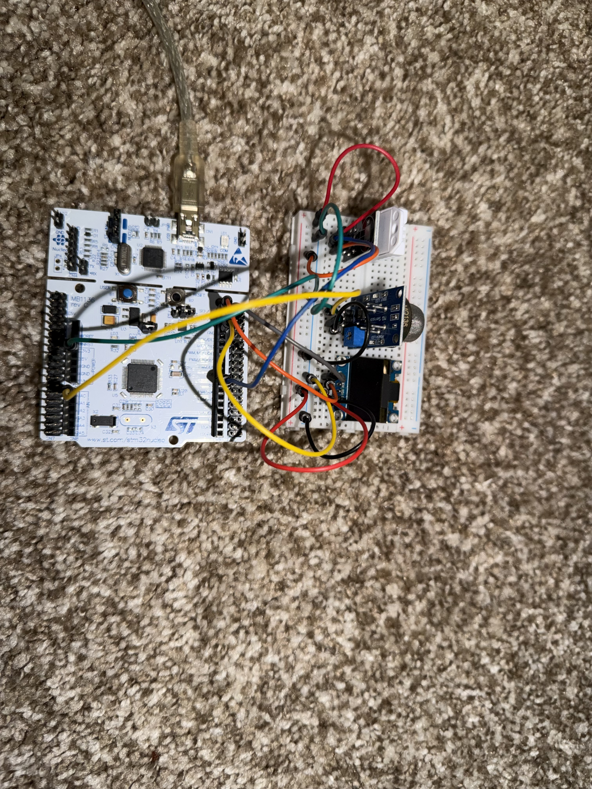
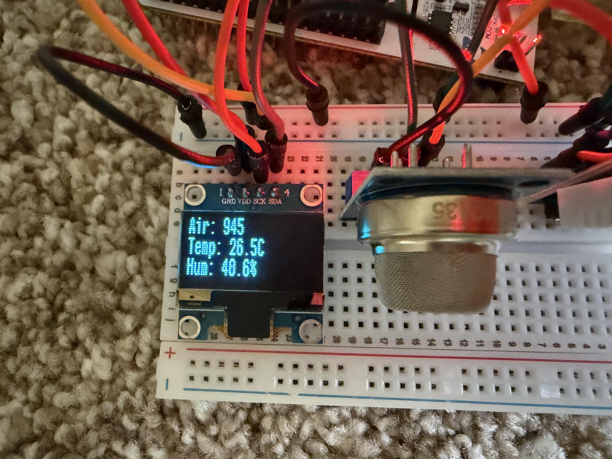
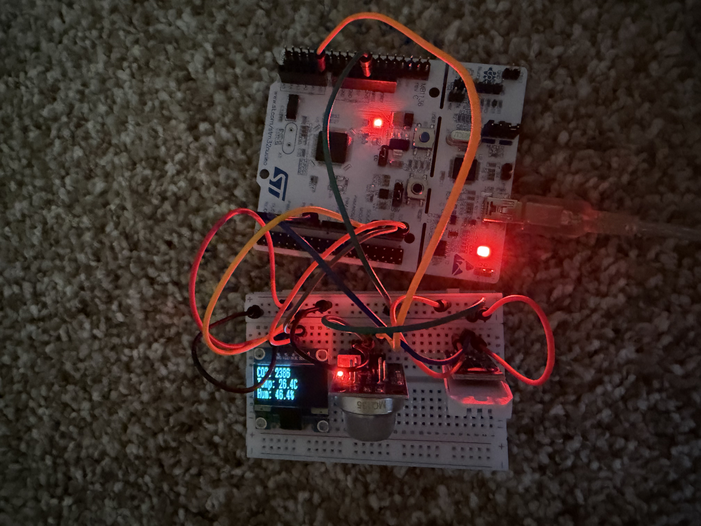

# STM32 Environmental Monitor

A real-time indoor environmental monitoring system built on the STM32F411RE Nucleo board. Reads CO2 levels, temperature, and humidity from three sensors and displays all values live on an OLED screen.

## Demo

## Hardware

| Component | Description |
|---|---|
| STM32F411RE Nucleo | Arm Cortex-M4, 100MHz, 512KB Flash |
| MQ135 | Air quality / CO2 gas sensor |
| DHT22 (AM2302) | Temperature and humidity sensor |
| SSD1306 OLED | 0.96" 128x64 I2C display |
| 400-point breadboard | Prototyping |

## Wiring

| Sensor | Pin | Nucleo Pin |
|---|---|---|
| MQ135 | VCC | 3.3V |
| MQ135 | GND | GND |
| MQ135 | A0 | A0 (PA0) |
| DHT22 | VCC | 3.3V |
| DHT22 | GND | GND |
| DHT22 | OUT | D7 (PA8) |
| OLED | VCC | 3.3V |
| OLED | GND | GND |
| OLED | SDA | D14 (PB9) |
| OLED | SCK | D15 (PB8) |

## Software

- **IDE:** STM32CubeIDE v2.x
- **Configuration:** STM32CubeMX (standalone)
- **HAL:** STM32F4xx HAL Driver
- **Libraries:**
  - [afiskon/stm32-ssd1306](https://github.com/afiskon/stm32-ssd1306) — OLED display
  - [controllerstech DHT22 DWT](https://controllerstech.com) — DHT22 1-wire protocol

## Peripheral Configuration

| Peripheral | Function | Pins |
|---|---|---|
| ADC1 IN0 | MQ135 analog read | PA0 |
| I2C1 | OLED communication | PB8 (SCL), PB9 (SDA) |
| GPIO Output | DHT22 data | PA8 |
| USART2 | Serial debug | PA2, PA3 |
| System Clock | 100MHz via HSI PLL | — |

## How It Works

**MQ135** outputs an analog voltage proportional to gas concentration. The STM32's 12-bit ADC reads this (0–4095) and converts it to CO2 ppm using the sensor resistance formula and sensitivity curve constants from the datasheet.

**DHT22** uses a proprietary 1-wire protocol — the MCU pulls the data line low to wake the sensor, then switches to input mode to receive 40 bits of temperature and humidity data encoded as timed pulses.

**SSD1306 OLED** receives display data over I2C1 at 100kHz. The library maintains a frame buffer that gets pushed to the display each cycle via `ssd1306_UpdateScreen()`.

## Known Limitations

- MQ135 powered at 3.3V instead of rated 5V — reduces sensitivity slightly
- R0 calibration value is approximate — sensor requires 24-48 hour burn-in for accurate absolute ppm readings
- No voltage divider on MQ135 A0 output (safe at 3.3V supply)

## CO2 Reference

| PPM Range | Air Quality |
|---|---|
| 400–450 | Fresh outdoor air |
| 450–1000 | Normal indoor air |
| 1000–2000 | Poor ventilation |
| 2000+ | Unhealthy |

## Author

Sardar Rafayet Bin Murtaza  
Electrical Engineering, Michigan State University  
[GitHub](https://github.com/rafayetm0rtaza)
